# Introduction to Agentic AI

## What are AI Agents?

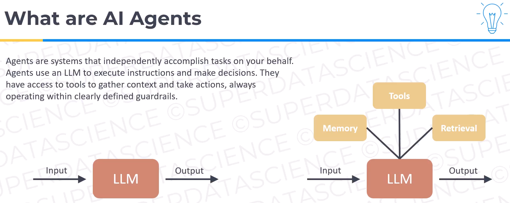

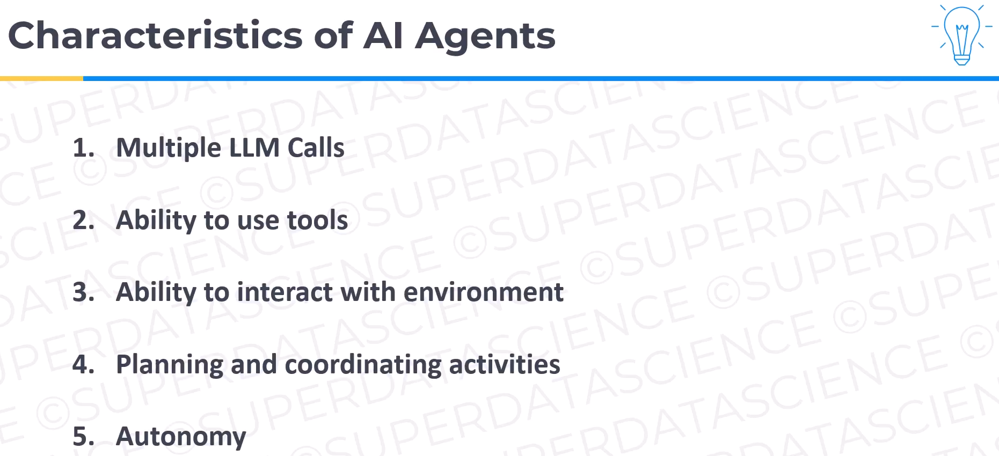

## Agentic AI Patterns

READ: [(Anthropic) Building Effective Agents](https://www.anthropic.com/engineering/building-effective-agentshttps://)

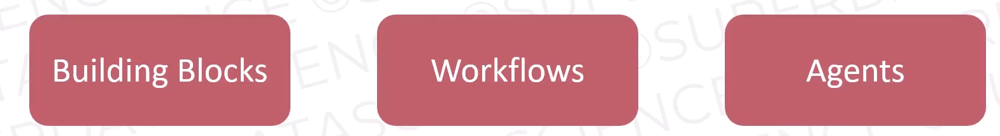 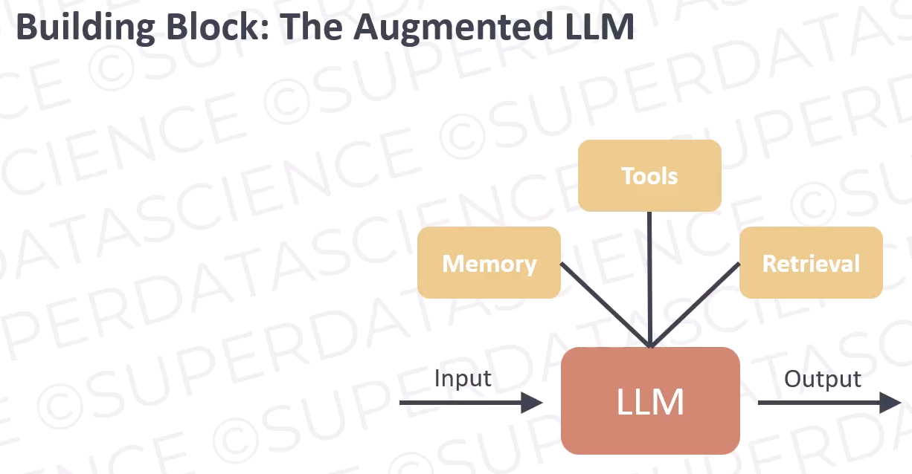

### Workflow Patterns

#### Prompt Chaining

 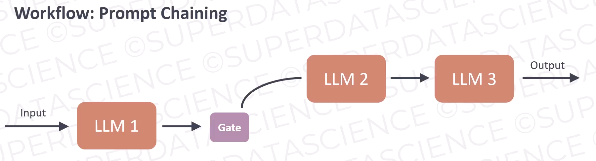

#### Router

 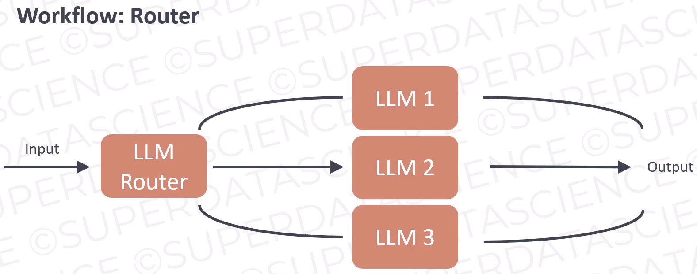

#### Parallelization

 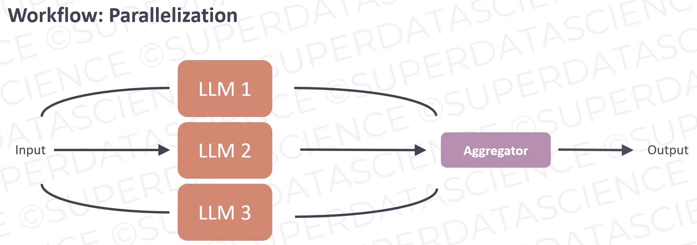

#### Orchestrator-Workers

 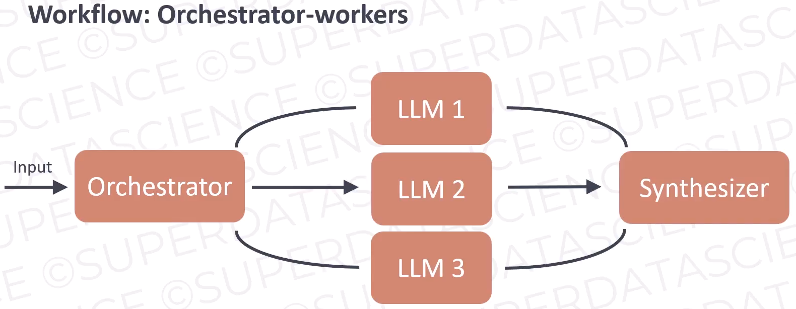

#### Evaluator-Optimizer

 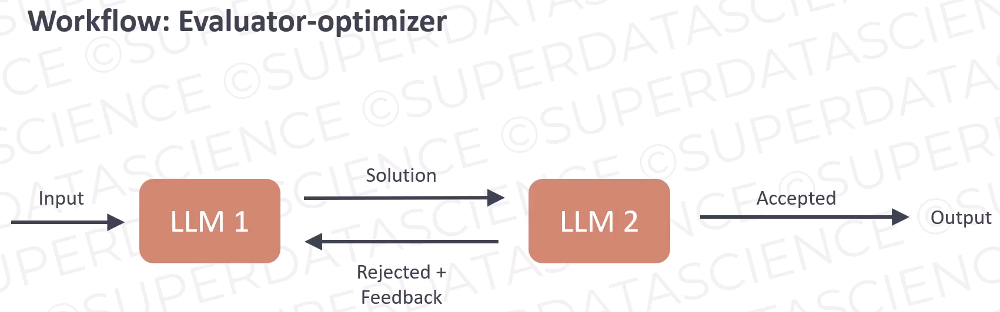

#### Agents

 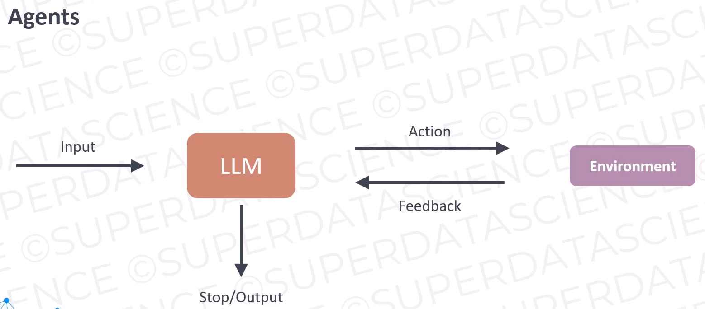

## Vibe Coding

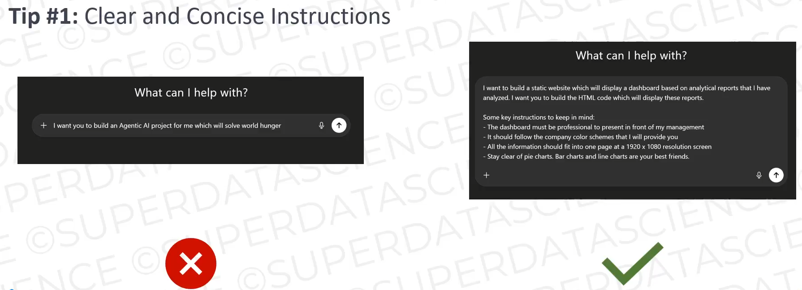 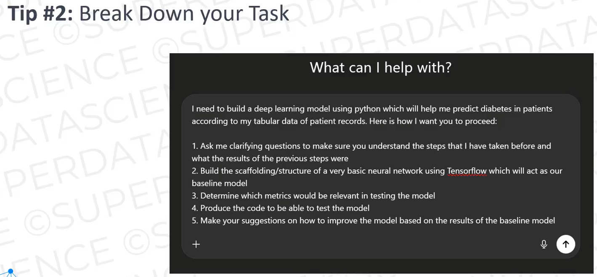

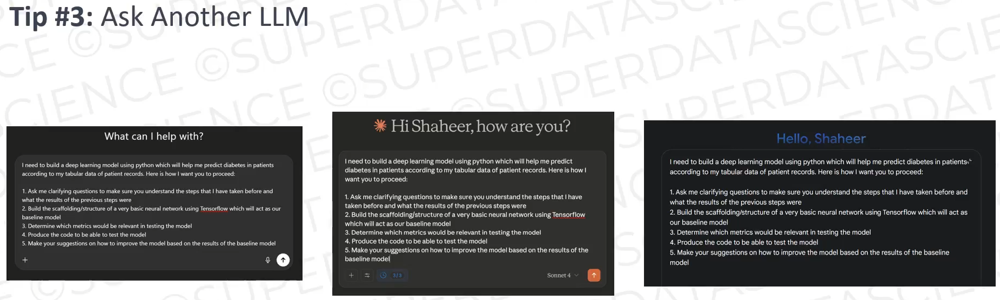 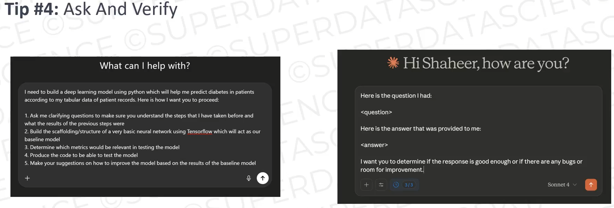

 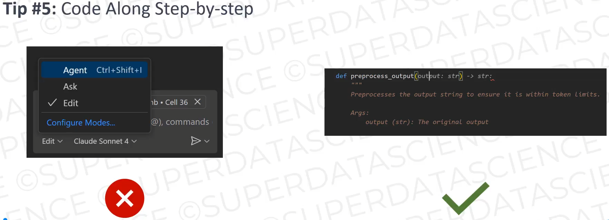
